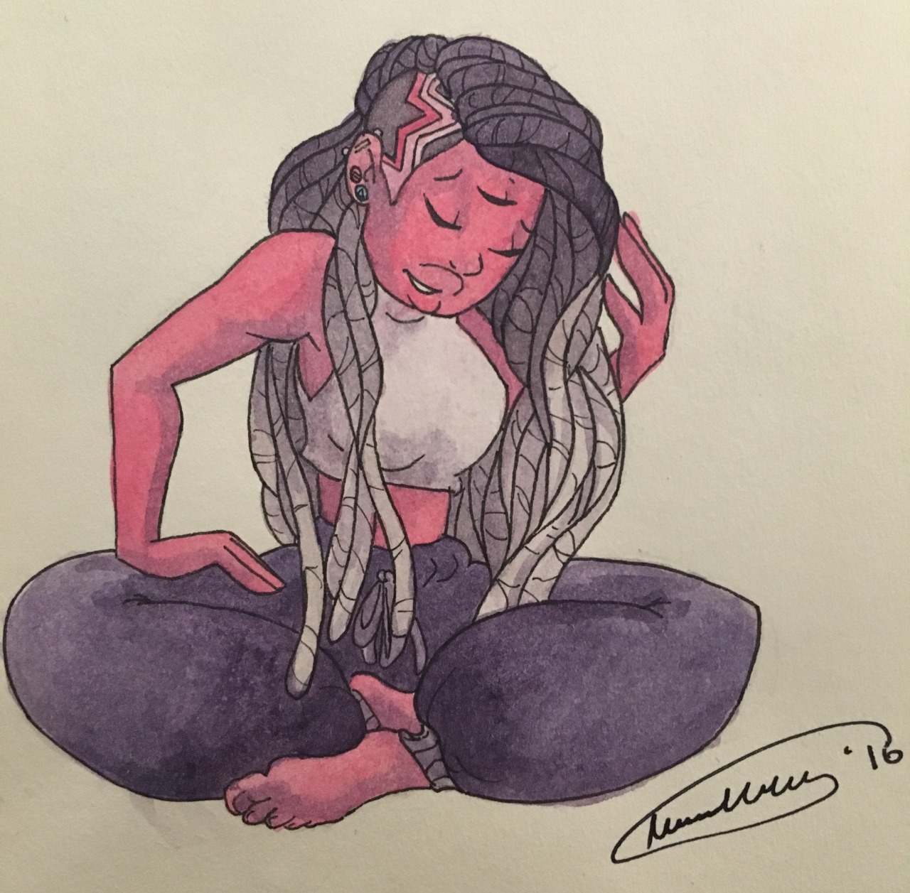

### Oiee, Seja bem-vindo ao meu perfil (@Igorltds)👋

 
  

  

  <a href="https://github.com/Igorltds">
  
  

 ##
 

  

  
   
 

asdfasdfa:
- Escolhendo entre dados e backend
- Estudando Python e Rust.

Contato:
- igorltds@outlook.com
- Se quiser saber mais  sobre mim de forma mais organica, recomendo meu linkedin: linkedin.com/in/igorltds

